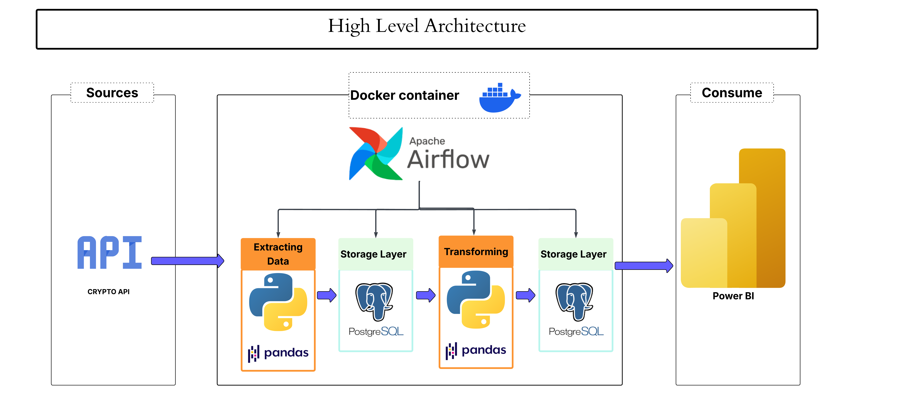
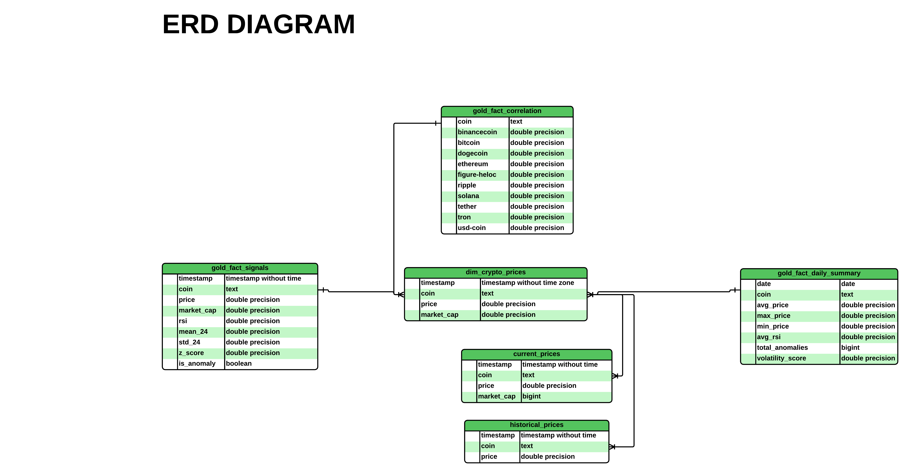

# Realtime Crypto Sentinel Pipeline 🚀

An end-to-end Data Engineering pipeline designed to monitor cryptocurrency market anomalies and correlations in real-time using the **Medallion Architecture**.

---

## 🏗️ Project Architecture
The infrastructure is fully containerized using **Docker**, orchestrated by **Apache Airflow**, and utilizes **PostgreSQL** as the primary data warehouse. It ensures a scalable and isolated environment for data processing.



---

## 🛠️ Tech Stack
* **Orchestration:** Apache Airflow (DAGs management)
* **Containerization:** Docker & Docker Compose
* **Data Processing:** Python (Pandas)
* **Database:** PostgreSQL (Relational Data Warehouse)
* **Visualization:** Power BI (DirectQuery Mode for real-time insights)

---

## 📊 Data Flow (Medallion Approach)
We implement the **Medallion Architecture** to maintain high data quality and lineage:

1.  **Bronze Layer:** Ingesting raw API data directly into `current_prices` and `historical_prices` tables.
2.  **Silver Layer:** Cleansing, handling missing values, and structuring data into the `dim_crypto_prices` dimension table.
3.  **Gold Layer:** High-value analytical tables like `gold_fact_signals`, `gold_fact_daily_summary`, and `gold_fact_correlation` for direct consumption by BI tools.

.png)

---

## 🗄️ Data Modeling (Star Schema)
The data warehouse is modeled using a **Star Schema** to optimize query performance and simplify the analytical reporting process.

* **Dimension Table:** `dim_crypto_prices` (Unique metadata for each coin).
* **Fact Tables:** Multiple analytical tables linked via **One-to-Many (1:N)** relationships to the dimension table.



---

## 🚀 Key Features
* **Real-time Monitoring:** Integration with Power BI using **DirectQuery** to ensure analysts see price movements as they happen.
* **Anomaly Detection:** Automated Python scripts to flag market volatility and unusual trading signals.
* **Orchestrated ETL:** Reliable data pipelines scheduled and monitored via Airflow, ensuring 24/7 data availability.
* **Infrastructure as Code:** Easy to deploy and replicate using Docker Compose.

---

## 🏁 Getting Started

### 1. Prerequisites
* Docker & Docker Compose installed.
* Git installed.

### 2. Setup
1. Clone the repository:
   ```bash
   git clone [https://github.com/Abdallah531/Realtime-Crypto-Sentinel-Pipeline.git](https://github.com/Abdallah531/Realtime-Crypto-Sentinel-Pipeline.git)
   cd Realtime-Crypto-Sentinel-Pipeline
   
### 3. Spin up the infrastructure:
  docker-compose up -d
  
### 4. Access the Airflow UI at http://localhost:8080 to trigger your DAGs.

## 👨‍💻 Author
Abdallah Mahmoud Data Engineer 
